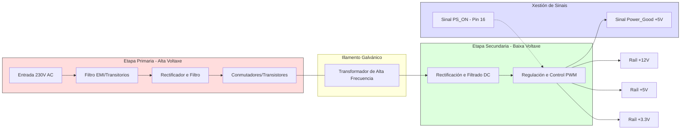

# Exemplos do Tema 02: Fontes de Alimentación

## Diagrama de bloques dunha fonte conmutada (SMPS)

A continuación móstrase o fluxo lóxico da corrente e os sinais de control nunha fonte ATX moderna:

