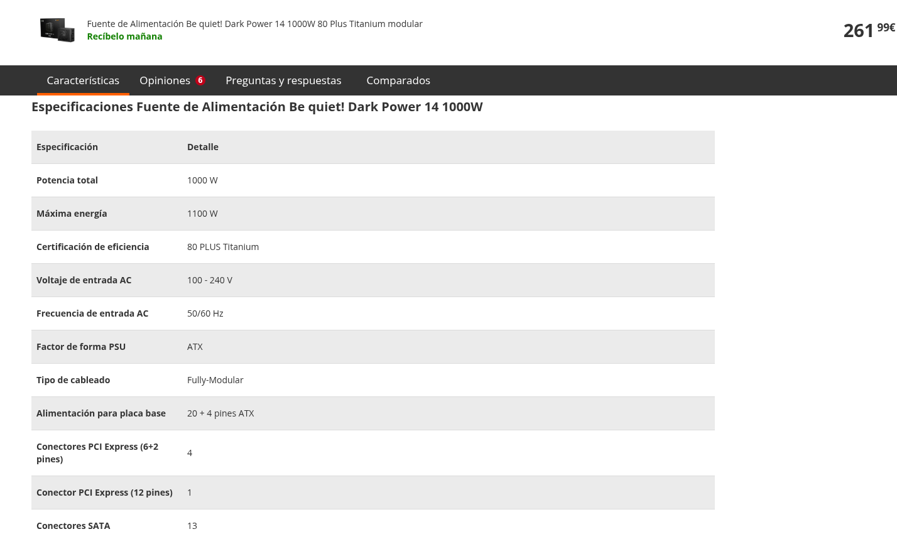
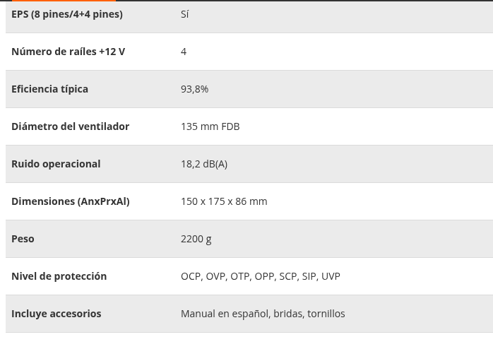

# Exercicios
## Exercicio de Análise: Fontes de Alimentación

**Obxectivo:** Aprender a interpretar as fichas técnicas de hardware para identificar a calidade e compatibilidade dunha fonte de alimentación (PSU).

**Instrucións:** Visita a ligazón de [PcComponentes - be quiet! Dark Power 14](https://www.pccomponentes.com/fuente-alimentacion-fuente-de-alimentacion-be-quiet-dark-power-14-1000w-80-plus-titanium-modular) e completa a seguinte ficha de análise. **Debes indicar o dato e copiar o texto literal da páxina onde o atopaches, ou unha captura de pantalla.**

---

### Ficha de Análise Técnica

#### 1. Clasificación da Gama

* **Categoría:** (Baixa / Media / Alta)
* **Xustificación:** (Indica polo menos dúas características que xustifiquen esta gama).
* > **Atopado en:** *Copiar texto da web aquí ou pega a imaxe...*

#### 2. Potencia Nominal

* **Watios Totais:** * > **Atopado en:** *Copiar texto da web aquí ou pega a imaxe...*

### 3. Xestión de Cableado

* **Tipo de construción:** (¿Modular, Semimodular o Integrada?)
* > **Atopado en:** *Copiar texto da web aquí ou pega a imaxe...*

### 4. Seguridade e Protección

* **Niveis de protección electrónica:** (Cita as siglas técnicas como OVP, SCP, etc.)
* > **Atopado en:** *Copiar texto da web aquí ou pega a imaxe...*

### 5. Eficiencia e Calidade

* **Certificado 80 Plus:**
* **Outras certificacións:** (Ruído, seguridade...)
* > **Atopado en:** *Copiar texto da web aquí ou pega a imaxe...*

### 6. Estándares e Conectores Críticos

* **Versión ATX:**
* **Versión PCIe:**
* **Conectores EPS (CPU):**
* > **Atopado en:** *Copiar texto da web aquí ou pega a imaxe...*

### 7. Multi-Rail ou Single-Rail

Indica se é Multi ou Single Rail de 12V.
> Atopado en:** *Copiar texto da web aquí ou pega a imaxe...*
> 
### 8. Factor de forma
Indica o factor de forma para a que é compatible.

### 9. Reconto de Conectores (Táboa de Conectividade)

| Tipo de Conector | Cantidade Total | Onde se indica na web? |
| --- | --- | --- |
| **P-SATA (Discos duros)** |  |  |
| **PCIe 6+2 pins** |  |  |
| **12V-2x6 (PCIe 5.1)** |  |  |
| **PATA (Molex)** |  |  |

### 10. Capacidade de Almacenamento

* **¿Cantos discos SATA permite conectar simultaneamente?**

---

# Exercicio de Análise: Fontes de Alimentación

**Obxectivo:** Aprender a interpretar as fichas técnicas de hardware para identificar a calidade e compatibilidade dunha fonte de alimentación (PSU).

**Instrucións:** Visita a ligazón de [PcComponentes - Corsair CX750](https://www.pccomponentes.com/corsair-cx750-750-w-80-plus-bronze) e completa a seguinte ficha de análise. **Debes indicar o dato e copiar o texto literal da páxina onde o atopaches, ou unha captura de pantalla.**

**Fonte: Fuente Alimentación Corsair CX750 750 W 80 Plus Bronze**

---

## Ficha de Análise Técnica

### 1. Clasificación da Gama

* **Categoría:** (Baixa / Media / Alta)
* **Xustificación:** (Indica polo menos dúas características que xustifiquen esta gama).
* > **Atopado en:** *Copiar texto da web aquí ou pega a imaxe...*

### 2. Potencia Nominal

* **Watios Totais:** * > **Atopado en:** *Copiar texto da web aquí ou pega a imaxe...*

### 3. Xestión de Cableado

* **Tipo de construción:** (¿Modular, Semimodular o Integrada?)
* > **Atopado en:** *Copiar texto da web aquí ou pega a imaxe...*

### 4. Seguridade e Protección

* **Niveis de protección electrónica:** (Cita as siglas técnicas como OVP, SCP, etc.)
* > **Atopado en:** *Copiar texto da web aquí ou pega a imaxe...*

### 5. Eficiencia e Calidade

* **Certificado 80 Plus:**
* **Outras certificacións:** (Ruído, seguridade...)
* > **Atopado en:** *Copiar texto da web aquí ou pega a imaxe...*

### 6. Estándares e Conectores Críticos

* **Versión ATX:**
* **Versión PCIe:**
* **Conectores EPS (CPU):**
* > **Atopado en:** *Copiar texto da web aquí ou pega a imaxe...*

### 7. Multi-Rail ou Single-Rail

Indica se é Multi ou Single Rail de 12V.
> Atopado en:** *Copiar texto da web aquí ou pega a imaxe...*
> 
### 8. Factor de forma
Indica o factor de forma para a que é compatible.

### 9. Reconto de Conectores (Táboa de Conectividade)

| Tipo de Conector | Cantidade Total | Onde se indica na web? |
| --- | --- | --- |
| **P-SATA (Discos duros)** |  |  |
| **PCIe 6+2 pins** |  |  |
| **12V-2x6 (PCIe 5.1)** |  |  |
| **PATA (Molex)** |  |  |

### 10. Capacidade de Almacenamento

* **¿Cantos discos SATA permite conectar simultaneamente?**

---

# Exercicio de Análise: Fontes de Alimentación

**Obxectivo:** Aprender a interpretar as fichas técnicas de hardware para identificar a calidade e compatibilidade dunha fonte de alimentación (PSU).

**Instrucións:** Visita a ligazón de [PcComponentes - Gigabyte 650W](https://www.pccomponentes.com/fuente-alimentacion-fuente-de-alimentacion-gigabyte-650w-80-plus-gold-modelo-p650g-enfriamiento-activo) e completa a seguinte ficha de análise. **Debes indicar o dato e copiar o texto literal da páxina onde o atopaches, ou unha captura de pantalla.**

**Fonte: Fuente Alimentación Gigabyte 650W**

---

## Ficha de Análise Técnica

### 1. Clasificación da Gama

* **Categoría:** (Baixa / Media / Alta)
* **Xustificación:** (Indica polo menos dúas características que xustifiquen esta gama).
* > **Atopado en:** *Copiar texto da web aquí ou pega a imaxe...*

### 2. Potencia Nominal

* **Watios Totais:** * > **Atopado en:** *Copiar texto da web aquí ou pega a imaxe...*

### 3. Xestión de Cableado

* **Tipo de construción:** (¿Modular, Semimodular o Integrada?)
* > **Atopado en:** *Copiar texto da web aquí ou pega a imaxe...*

### 4. Seguridade e Protección

* **Niveis de protección electrónica:** (Cita as siglas técnicas como OVP, SCP, etc.)
* > **Atopado en:** *Copiar texto da web aquí ou pega a imaxe...*

### 5. Eficiencia e Calidade

* **Certificado 80 Plus:**
* **Outras certificacións:** (Ruído, seguridade...)
* > **Atopado en:** *Copiar texto da web aquí ou pega a imaxe...*

### 6. Estándares e Conectores Críticos

* **Versión ATX:**
* **Versión PCIe:**
* **Conectores EPS (CPU):**
* > **Atopado en:** *Copiar texto da web aquí ou pega a imaxe...*

### 7. Multi-Rail ou Single-Rail

Indica se é Multi ou Single Rail de 12V.
> Atopado en:** *Copiar texto da web aquí ou pega a imaxe...*
> 
### 8. Factor de forma
Indica o factor de forma para a que é compatible.

### 9. Reconto de Conectores (Táboa de Conectividade)

| Tipo de Conector | Cantidade Total | Onde se indica na web? |
| --- | --- | --- |
| **P-SATA (Discos duros)** |  |  |
| **PCIe 6+2 pins** |  |  |
| **12V-2x6 (PCIe 5.1)** |  |  |
| **PATA (Molex)** |  |  |

### 10. Capacidade de Almacenamento

* **¿Cantos discos SATA permite conectar simultaneamente?**
* > **Atopado en:** *Copiar texto da web aquí ou pega a imaxe...*

