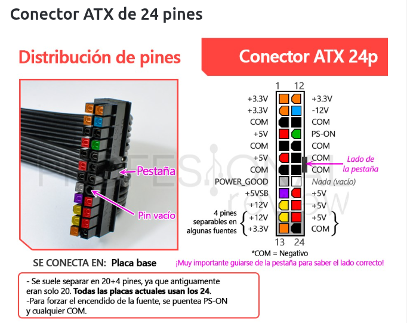
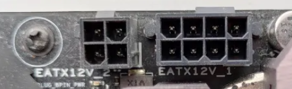
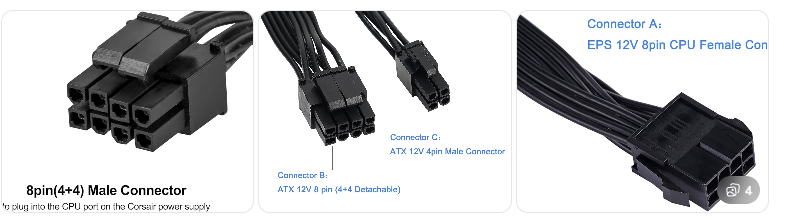
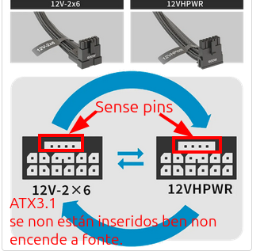
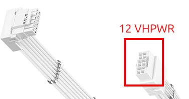
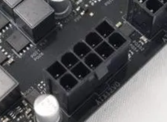
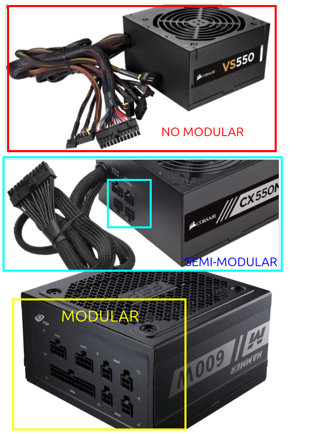
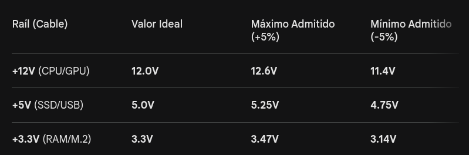
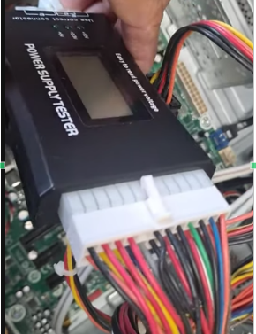

# Fontes de Alimentación para PC

A fonte de alimentación é o compoñente encargado de converter a **Corrente Alterna (AC)** da rede eléctrica (230V en España) en varias **Correntes Continuas (DC)** que alimentan os circuítos do ordenador.

## 1. Funcionamento e Tipoloxía

* **Fonte Conmutada:** As fontes modernas son conmutadas, o que significa que necesitan unha carga (aparello conectado) para funcionar correctamente.


* **Proceso de Conversión:** Transforma a tensión de entrada en voltaxes estables de $+3.3V$, $+5V$, $+12V$ e $-12V$.


> Na seguinte páxina pódense ver os conectores de alimentación e obter información adicional [Conectores da placa base de alimentación](https://www.geeknetic.es/Guia/2211/Conectores-de-Placa-Base-Todos-los-tipos-y-modelos.html)
## 2. Pinaxe do Conector ATX (24 pins)

Na seguinte imaxe pódense ver os pines dun conector ATX 24 pines, que se conecta o **mainpower** da placa base.:



### Táboa Completa de Voltaxes: Conector Fonte-Placa Base (24 Pins)

| Pin | Nome | Color | Descrición |
| --- | --- | --- | --- |
| **1,2,12,13** | +3.3V | Naranja | Power +3.3V 
 |
| **3,5,7,15,17,18,19,24** | GND | Negro | Masa 
 |
| **4,6,21,22,23** | +5V | Rojo | +5V DC 
 |
| **8** | PWRGOOD | Gris | Sinal de que as voltaxes son estables (PWRGOOD) 
 |
| **9** | +5V SB | Violeta | +5V Standby; mantén tensión co equipo apagado (Wake On Lan) 
 |
| **10,11** | +12V | Amarillo | +12V DC (Para portos serie RS232 e conectores audio moi antigos)
 |
| **14** | -12V | Azul | -12V DC 
 |
| **16** | PW-ON | Verde | Remote Power ON/OFF; usado para testear a fonte facendo unha ponte - Conectado á placa base para que se **encenda o PC ao pulsar no botón de encendido**.
 

## 3. Conector EPS (4+4 ou 8 pines)

Os cables EPS (Entry-Level Power Supply) son os encargados de **levar a enerxía exclusivamente ao procesador (CPU)**. Conéctanse na parte superior da placa base, preto do socket do procesador.

Aínda que todos parecen iguais os fabricantes deséñanos de dúas formas para que sexan compatibles con calquera placa:
* **EPS 4+4 pines**: O conector está "partido" á metade. Podes xuntalos para formar un bloque de 8 pins ou usar só 4 se a túa placa base é de gama baixa.
* **EPS 8 pins (fixo)**: É un bloque sólido de 8 pins. Úsase en fontes de máis potencia e placas modernas.
* **Dobre EPS (8+4 ou 8+8)**: As placas base para procesadores moi potentes (como un **i9 ou un Ryzen 9**) teñen dous enchufes. Nestes casos, necesitas que a túa fonte traia dous cables EPS independentes.




> **É importante non confundir os cables EPS (4+4) cos PCIe (6+2) (para tarxetas gráficas), xa que ambos teñen 8 pines, pero non son intercambiables, a polaridade (onde vai o positivo e o negativo) é inversa entre eles.**

---

 ## 4. Conecttores e estándares modernos

### O Estándar ATX 3.0 (12VHPWR - PCIe 5.0) / 3.1 (12V-2x6 - PCIe 5.1)

Este estándar:
* É capaz de subministrar ata **600W** cun só cable.
* Inclúe pins de comunicación directa entre a fonte e a GPU para xestionar picos de potencia.

Coa chegada das gráficas de alto consumo (RTX 4000 e superiores), o estándar evolucionou para evitar fallos eléctricos:

* **12VHPWR (ATX 3.0)**: O conector orixinal de 16 pins (12 de potencia + 4 de sinal). Capaz de subministrar ata **600W** nun so cable. Conectores moi longos, se o cable non estaba perfectamente inserido ata o fondo (aínda que fose por un milímetro), os pins de potencia podian quentarse en exceso e **derreter o conector**.
* **12V-2x6 (ATX 3.1)**: É a revisión actual. Fisicamente igual ao anterior pero con **pins de sinal máis curtos**. Se o cable non está totalmente inserido, os pins de sinal non fan contacto, e a fonte non envía enerxía, evitando que o conector se derrita por sobrequecemento.
* **Especificación PCIe 5.1**: É o estándar que acompaña ao ATX 3.1. Está deseñado especificamente para que a gráfica e a fonte **xestionen mellor os picos de potencia transitorios**. Isto evita que o OCP (Overcurrent Protection) da fonte salte por erro ante un aumento repentino de demanda de microsegundos, algo moi común nas series RTX 40 e 50. **Este estándar asegura que a fonte non se apague nun pico de consumo repentino**.

* **Pins de comunicación (Sense Pins)**: Permiten que a GPU "saiba" canta potencia pode extraer da fonte, como máximo serían 600W, pero estes indican canto (150W, 300W, 450W ou 600W).



### ATX12VO (Intel)

Mencionado como posible estándar, o **ATX12VO (12 Volts Only)** elimina as liñas de 3.3V e 5V da fonte, enviando só 12V á placa base. Isto aumenta a eficiencia, pero **require que a placa base faga a conversión para o resto de compoñentes**.

Non se usa demasiado, xa que conleva un redeseño da placa base, adoita usarse en:
* **Equipos OEM**, en PCs premontados de marcas como **Dell, HP ou Lenovo**, o máis probable é que xa estean usando ATX12VO ou unha variante propietaria similar.
* Placas habituais son poucas, unha por exemplo é **ASRock Z790/Z690 Phantom Gaming 4/12VO**, o seu conector MainPower será de 10 pins en vez de 24.


---

## 5. Cableado Modular

* **Non modular:** Todos os cables saen fixos da fonte.
* **Semi-modular:** Os cables básicos (ATX) son fixos, o resto quítanse.
* **Totalmente modular:** Podes conectar só os cables que necesites, mellorando o fluxo de aire na caixa.


> Vídeo: [Escolle unha fonte modular, no modular, semi-modular](https://www.youtube.com/watch?v=7lNceuYrj0c)

---

## 6. Características para a Compra

### Factor de Forma e Potencia

* **Formatos:** ATX (estándar), SFX (equipos pequenos) ou Flex ATX.


* **Potencia:** Actualmente recoméndanse polo menos **600W-750W** para equipos de gama media-alta para evitar mal funcionamentos por falta de enerxía.

### Eficiencia Enerxética (Certificación 80 Plus)

Categoriza as fontes segundo a enerxía que aproveitan (evitando perdas por calor):

* **Gama Básica/Media:** Bronze, Silver, Gold (as máis comúns).
* **Gama Alta:** Platinum e Titanium.

Actualmente mídense as fontes pola certicación **Cybenetics**:

* mide mellor as combinacións de carga
* mide a eficiencia
* mide o traballo das fontes traballando a temperaturas máis altas
* PROBA mellor o OCP e OVP. 

Mídese tamén en *Bronze, Silver, Gold, Platinum, Titanium*, se ten **Gold** asegura as proteccións OCP e OVP.

### Ruído e Proteccións

* **Niveis sonoros:** Idealmente por debaixo dos **20dB** para un funcionamento silencioso.

* **Proteccións Esenciais:**
    * **OVP (Overvoltage):** Apaga a fonte se a tensión supera o límite (ex: 6.25V nunha liña de 5V). Céntrase na **Tensión/Voltaxe** (como se nun *río fose a presión de auga* Voltios). Protexe contra destrución de compoñentes electrónicos, é dicir, **contra chips queimados**.
    * **OCP (Overcurrent):** (céntrase na **Intensidade-amperios**, é dicir, *coma se nun río fora a cantidade de auga*), que protexe fronte ao **exceso de calor nos cables**. En concreto, protexe a fonte e ao equipo contra exceso de demanda de corrente. 
    Por exemplo, se un compoñente (como unha RTX 4090) *tenta absorber máis corrente da que ese cable ou raíl pode soportar* con seguridade, o **OCP detecta o exceso e apaga a fonte** instantaneamente, senón produciríase un sobrequentamento e incluso podería provocarse un incendio. O OCP é diferente segundo esteamos nunha fonte dun Rail único ou multi-rail_:
        * **Single-Rail**: Ten un límite moi alto. Por exemplo, se a fonte é de 1000W, o OCP só saltará se a suma total de todo o PC supera o límite máximo da fonte.
        * **Multi-Rail**: Divide a potencia en "grupos". Se un cable PCIe tenta pedir 40A e o seu raíl está limitado a 30A, o OCP salta nese grupo, protexendo mellor os cables individuais.
        * En placas modernas, hai fontes, por exemplo as novas gráficas (RTX 40/50) que piden por exemplo 300W e de súpeto solicitan 600W, **os OCP, están configurados para que permitan este pico, pero se persiste apaguen a fonte**.
    * **Tempo de Mantemento:** Capacidade de manter a enerxía uns milisegundos ante un microcorte (se queres que se sincronice cun SAI, o tempo de mantemento da túa fonte debe ser superior ao tempo de reacción dun SAI, *por exemplo, se o SAI tarda 16ms en actuar, o tempo de mantemento da túa fonte debe ser de a lo menos 16ms ou máis*).

---

## 6. Calculadoras de potencia de fontes de alimentación

### Que é importante para calcular a potencia dunha fonte**

Para calcular a **potencia dunha fonte de alimentación (PSU)** hai que sumar o consumo dos compoñentes principais do ordenador.

#### Compoñentes que máis consumen

1. **CPU (procesador)**

   * Consumo indicado polo **TDP** (Thermal Design Power).
   * Exemplo: ~65 W.

2. **GPU (tarxeta gráfica)**

   * É normalmente o compoñente que **máis consume**.
   * Exemplo: 120 W.

3. **Placa base**

   * Controladores, chipsets, etc.
   * Aproximadamente **30-50 W**.

4. **Memoria RAM**

   * Uns **3-5 W por módulo**.

5. **Discos (SSD / HDD)**

   * SSD → 3-5 W
   * HDD → 6-10 W

6. **Ventiladores, USB, periféricos**

   * Uns **10-20 W**.


### Fórmula básica


```
Potencia total ≈ CPU + GPU + placa base + RAM + discos + outros
```

### Marxe de seguridade

Sempre se recomenda **engadir un 20-30 % máis** de potencia.

Exemplo:

```
Consumo real → 300 W
Fonte recomendada → 400-450 W
```

Isto faise porque:

* hai **picos de consumo**
* mellora a **eficiencia da fonte**
* permite **actualizacións futuras**

Nun sistema con **i5 + GTX 1060**, o consumo típico baixo carga adoita estar arredor de **250-300 W**, polo que se recomenda unha fonte duns **400-500 W**. 

### Calculadoras de potencia - Ligazóns

* **Newegg Power Supply Calculator**: [https://www.newegg.com/tools/power-supply-calculator](https://www.newegg.com/tools/power-supply-calculator). É unha das calculadoras máis coñecidas para montar PCs. 

* **OuterVision Power Supply Calculator**: [https://outervision.com/power-supply-calculator](https://outervision.com/power-supply-calculator). Moi completa (podes meter **overclock, ventiladores, bombas, etc.**). Moi usada en foros de hardware. 
* **WhatPSU**: [https://www.whatpsu.com](https://www.whatpsu.com). Calcula a PSU a partir de **CPU + GPU** principalmente. Tamén recomenda **modelos de fontes** compatibles. 


## 7. Como comprobar unha fonte?

Se sospeitas dun fallo, podes testar a fonte de diversos modos. Ten en conta que cada cable aplícase a regra do 5% de exceso ou defecto de Voltaxe. Co cual os rangos nos que consideramos que a fonte funciona correctamente son:



Tester para poder medir as voltaxes temos:

1. Utilizar un **Power Supply Tester**  (dispositivo con pantalla que indica voltaxes): Dispositivo que se conecta ao cable de 24 pins e amosa nunha pantalla LCD se os valores de +12V, +5V e +3.3V están dentro dos rangos permitidos.
[Comprobar unha fonte cun Power Supply Tester](https://www.youtube.com/watch?v=F81j0KGX4FA)


2. Medir manualmente cun **voltímetro/multímetro** cada pin. [Vídeo explicativo de como medir as tensións co multímetro - poñendoo en 20V](https://www.youtube.com/watch?v=nv8yor7fK-I)


3. Facer a **ponte** entre o pin verde (16) e un negro (GND) para ver se o ventilador arrinca. Este método **non funciona**:
    * Coas fontes propietarias.
    * Fontes que teñen ventiladores semi-pasivos, que non se arranca o ventilador ao encender a fonte.

---

# Conectores máis comúns que traen as fontes de alimentación

As fontes de alimentación modernas veñen cunha serie de cables estandarizados para alimentar os diferentes compoñentes. Dependendo de se a túa fonte é **modular** (podes quitar os cables que non uses) ou **fixa**, verás os seguintes conectores:


---

### 1. Cables de Placa e Procesador (Fundamentais)

* **ATX 24 pins:** É o cable máis groso e grande. Alimenta a placa base en xeral (chipset, ranuras PCIe, RAM).
* **EPS/CPU (4+4 pins):** Conéctase na parte superior da placa base. Dedícase exclusivamente a dar enerxía ao procesador. As placas potentes poden pedir dous destes cables.

---

### 2. Cables para Gráficas (Vídeo)

* **PCIe (6+2 pins):** O estándar clásico para as tarxetas gráficas. Deséñase con "2 pins extra" para ser compatible tanto con entradas de 6 como de 8 pins.
* **12VHPWR (12+4 pins):** O novo conector das fontes **ATX 3.0/3.1** (necesario para as RTX 40 e superiores). É un cable único capaz de enviar ata **600W**, substituíndo a necesidade de usar tres ou catro cables PCIe antigos.

---

### 3. Cables de Periféricos e Almacenamento

* **SATA:** Cable fino e plano con forma de "L". Úsase para discos duros SSD/HDD de 2.5", controladoras de luces RGB ou hubs de ventiladores.
* **MOLEX (4 pins):** Un conector antigo e grande. Hoxe en día úsase moi pouco, principalmente para bombas de refrixeración líquida vellas ou accesorios simples.

> **Consello de seguridade:** Se a túa fonte é modular, **usa só os cables que viñeron na súa caixa**. Aínda que os conectores parezan iguais noutras marcas, o esquema de cables interno pode ser distinto e poderías queimar os teus compoñentes se os intercambias.

> Máis información: [https://thepcbottleneckcalculator.com/psu-calculator/](https://thepcbottleneckcalculator.com/psu-calculator/)

---

# **Esquema de posibles erros e causas nas fontes de alimentación**

1.  **Erros de Conexión e Configuración Externa**
    *   **Interruptores**: Fonte de alimentación apagada ou interruptor de voltaxe (vermello) nunha posición incorrecta.
    *   **Cableado**: Cable de alimentación mal enchufado ou conectores internos cara á placa base frouxos.

2.  **Indicadores de Fallo Físico e Inmediato**
    *   **Sinais sensoriais**: Presenza de **fume**, **cheiro a queimado** ou **ruídos estraños** (como chispas) ao intentar o arranque.
    *   **Ausencia de actividade**: O ventilador da fonte ou o disco ríxido non xiran ao premer o botón de acendido.
    *   **Indicadores LED**: O LED da placa base permanece apagado malia estar a fonte enchufada.

3.  **Causas Externas e Ambientais**
    *   **Sobrecargas eléctricas**: Danos derivados de tormentas eléctricas ou traballos na rede eléctrica da vivenda.
    *   **Danos por obxectos**: Introdución incorrecta de dispositivos en portos (USB, tarxetas) ou presenza de obxectos metálicos estraños (como parafusos caídos) que provocan **curtocuítos**.

4.  **Incompatibilidade e Fallos de Hardware**
    *   **Hardware defectuoso**: Compoñentes como os lectores de tarxetas de medios poden causar curtocuítos que fan que a PSU pareza fallar.
    *   **Especificacións incorrectas**: Uso dunha fonte que non proporciona a **potencia suficiente** ou que non coincide coas especificacións orixinais da máquina.

---
Tabla de diagnósticos típicos:


---

Resumo de Diagnósticos:


---

