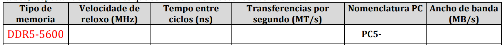
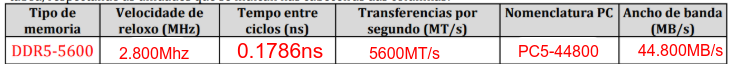
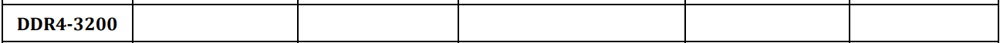

# Memoria RAM: Exercicios Prácticos

## 1. Exercicios de Cálculo e Comprensión Teórica

### 1.1 Ejercicio: Cálculo de Latencia en Nanosegundos

**Enunciado:**
Un usuario ten dúas memórias disponibles para compra:

- Opción A: DDR4-3600 CL16
- Opción B: DDR5-6000 CL30

Calcúa a latencia real en nanosegundos para ambas e indica cal é máis rápida en termos reais.

**Solución:**

**Opción A - DDR4-3600 CL16:**
$$\text{Latencia} = \frac{16}{3600} \times 1000 = 4.44 \text{ ns}$$

**Opción B - DDR5-6000 CL30:**
$$\text{Latencia} = \frac{30}{6000} \times 1000 = 5 \text{ ns}$$

**Conclusión:** A opción A (DDR4-3600) ten menor latencia real, pero a diferenza é pequena (0.56 ns). DDR5 compensa con maior ancuro de banda.

---

### 1.2 Exercicio: Ancho de Banda en Dual Channel

**Enunciado:**
Calcula o ancuro de banda total para as seguintes configuracións:

a) 2 × 8GB DDR5-5600 en Dual Channel
b) 1 × 16GB DDR4-3200 en Single Channel

**Solución:**

**a) DDR5-5600 Dual Channel:**

- MT/s: 5600
- Bytes por ciclo: 8
- Canles: 2

$$\text{Ancuro Banda} = 5600 \times 8 \times 2 = 89.6 \text{ GB/s}$$

**b) DDR4-3200 Single Channel:**

- MT/s: 3200
- Bytes por ciclo: 8
- Canles: 1

$$\text{Ancuro Banda} = 3200 \times 8 \times 1 = 25.6 \text{ GB/s}$$

**Diferenza:** Dual Channel DDR5 ten **3.5× maior ancuro de banda**

---

### 1.3 Exercicio: Tempo de Transferencia de Datos

**Enunciado:**
Calcula o tempo requirido para transferir un fichero de 500 MB usando:

a) DDR4-3200 Single Channel
b) DDR4-3200 Dual Channel
c) DDR5-6000 Dual Channel

Fórmula: Tempo (ms) = Tamaño (MB) / Ancuro Banda (GB/s) × 1000

**Solución:**

**a) DDR4-3200 Single Channel (25.6 GB/s):**
$$T = \frac{500}{25.6} = 19.53 \text{ ms}$$

**b) DDR4-3200 Dual Channel (51.2 GB/s):**
$$T = \frac{500}{51.2} = 9.77 \text{ ms}$$

**c) DDR5-6000 Dual Channel (96 GB/s):**
$$T = \frac{500}{96} = 5.21 \text{ ms}$$

**Ganancia de Dual Channel vs Single:** **2× máis rápido**

### 1.4 Dado os seguinte módulo DIMM dame os datos 

#### DDR5

**Enunciado:**
Calcula os seguintes datos


**Solución:**



- Velocidade de Reloxo: 5600 MHz
- Tempo entre ciclos: **ns= 1000/MHz | ns = 1000/5600 = 0,1786 ns**
- Transferencias por segundo (MT/s): Como é DDR, envía datos no flanco de subida e no de baixada, polo tanto 5600*2= 11.200 MT/s
- Ancho de banda = MT/s* bits por transferencia. como pasa 64 bits ou o que é o mesmo 8Bytes, entón: 11200 MT/s*8 Bytes= 89600 MB/s
- - Nomenclaruta PC: MT/s* ancho bytes. Colle a info de Ancho de banda e ao ser DDR5 - PC5-89600

#### DDR4

**Enunciado:**
Calcula os seguintes datos



**Solución:**

- Velocidade de Reloxo: 3200 /2= 1600 MHz
- Tempo entre ciclos: **ns= 1000/MHz | ns = 1000/3200 = 0,3125 ns**
- Transferencias por segundo (MT/s): Na información do proveedor xa nos da as MT/s polo tanto son 3200MT/s
- Ancho de banda = 3200*8= 25600MB/s
- Nomenclaruta PC: MT/s* ancho bytes. Colle a info de Ancho de banda e ao ser DDR4 - PC4-25600

---

## 2. Exercicios de Identificación e Classificación

### 2.1 Exercicio: Identificar Tipo de Memoria por Imaxe

**Enunciado:**
Dado o seguinte elemento de placa base con 4 slots, identifica:

```shell
Placa Base AM5 (AMD Ryzen 7000+)
[Slot 1] [Slot 2] [Slot 3] [Slot 4]
  |        |        |        |
  A1       B1       A2       B2
```

a) Tipo de memoria soportado: ¿DDR4 ou DDR5?
b) Configuración recomendada DUAL CHANNEL: ¿Cales slots usar?
c) Se queres 32GB en máximo rendemento, ¿cantas DIMM necesitas e de que capacidade?

**Solución:**

a) **Tipo:** DDR5 (Socket AM5 é obrigatorio DDR5)

b) **Dual Channel:** Usa slots A1 + A2 (ou B1 + B2)

   - Ambas canles do mesmo lado da placa

c) **32GB máximo rendemento:**

   - 2 × 16GB DDR5 en Dual Channel (Slots A1 + A2)
   - Velocidade recomendada: DDR5-6000 EXPO

---

### 2.2 Exercicio: Análise de Etiqueta de Memoria

**Enunciado:**
Observa a seguinte especificación de memoria:

```shell
G.SKILL Trident Z5 RGB
Modelo: F5-6000J3036G16GX2
DDR5-6000 CL30-36-36-96
Voltage: 1.25V
Capacity: 32GB (2x16GB)
```

Identifica:

1. Velocidade base (MHz)
2. Latencia CAS (CL)
3. Número de DIMM e capacidade total
4. Perfil de overclocking (XMP/EXPO)
5. Se é compatible con AMD Ryzen 7000 (AM5)

**Solución:**

1. **Velocidade:** 6000 MHz
2. **CL:** 30 ciclos
3. **Configuración:** 2 DIMM × 16GB = 32GB total
4. **Perfil:** EXPO (indicador: "Z5" model series é EXPO-compatible)
5. **Compatibilidad AM5:** ✅ Sí (DDR5 + EXPO profile)

---

## 3. Exercicios de Troubleshooting

### 3.1 Exercicio: Diagnóstico de Computador que non Inicia

**Escenario:**
O usuario monta un PC novo:
- Placa Base: ASUS ROG STRIX B850-E
- Procesador: Ryzen 7 7700X
- Memoria: 2 × 16GB DDR5-6000 EXPO G.SKILL
- Fonte: 850W certificada 80+ Gold
- SSD: 1TB NVMe M.2

**Problema:** Ao conectar a fonte e premer Power, o ordenador fai beep unha soa nota longa e repítese cada 2 segundos. Pantalla en negro.

**Preguntas:**

a) ¿Que significa o códizo de beep "1 longo"?

b) ¿Cales son as causas máis probables (en orde de probabilidade)?

c) Lista 5 pasos de diagnóstico en orde, con accións específicas.

**Solución:**

a) **Beep "1 Longo":** Problema de MEMORIA RAM ou controlador de memoria non detecta memoria

b) **Causas Probables (Orde):**

   1. Memoria non inserida completamente
   2. Memoria inserida no slot incorrecto
   3. Memoria defectuosa (fallo de fabrica)
   4. Conectores de memoria dañados na placa base
   5. BIOS desactualizado

c) **Protocolo de Diagnóstico:**

| Paso | Acción | Resultado Esperado |
|------|--------|---|
| 1 | Desconecta todo (360 V, ±5 min) | Disipación de cargas |
| 2 | Abre a carcasa e verifica que DIMM estén totalmente inseridas (clips nos dous extremos) | Clips pechados; DIMM con ±5mm de afundamento |
| 3 | Proba con 1 × 16GB DDR5 no Slot A1 (máis prochega ao procesador) | Si arranca → problema con segundo DIMM ou slot B1 |
| 4 | Si non arranca nas paso 3, limpa contactos de DIMM con alcol isopropílico en zona ventilada | Non debe haber resíduos verdes de óxido |
| 5 | Reinséierte con presión uniforme e proba novamente | Beep desaparece e sistema arranca |

---

### 3.2 Exercicio: Solucionar Inestabilidade com XMP

**Escenario:**
Un usuario activa perfil XMP en Intel Core i5-13600K con DDR5-6000 EXPO (incompatibilidade: XMP é Intel, EXPO é AMD). O sistema crashea aleatoriamente con BSOD `DRIVER_IRQL_NOT_LESS_OR_EQUAL`.

**Preguntas:**

a) ¿Cal é o erro técnico cometido?

b) ¿Por que ocorren os crashes?

c) ¿Cal é a solución inmediata?

d) ¿Que pasos seguiría para diagnosticar memoria defectuosa?

**Solución:**

a) **Erro Técnico:** Incompatibilidade de perís — Intel usa XMP, non EXPO. Memoria DDR5 non é EXPO nesta placa base Intel.

b) **Por que Ocorren Crashes:** 

   - O perfil XMP esta configurado para procesadores Ryzen (AM5)
   - Placa base Intel (LGA1700) non interpreta correctamente os timings
   - Resulta en configuración inestable de voltaxe/timing

c) **Solución Inmediata:**

```
1. Reinicia en BIOS (F4 ou Del segundo ASUS)
2. Vai a "Overclocking" → "XMP" o "DOCP"
3. Cambia a "Disabled" ou "Auto (JEDEC)"
4. Garda cambios (Ctrl+S, Enter)
5. O sistema arrancará a DDR5-4800 JEDEC (máis estable)
```

d) **Protocolo de Diagnóstico (se persisten crashes):**
   - Desactiva XMP completamente
   - Executa MemTest86 durante 4-8 horas
   - Si no hay erros → problema era XMP
   - Si hay erros → memoria defectuosa (requiere RMA)

#### 3.2.1 Outro problema de OverClocking

**Enunciado:**

Mercamos unha memoria RAM de 6000 MHz, pero ao entrar no Sistema Operativo ve que só funciona a 4800 MHz. Comprobamos que a placa base é compatible, pero o sistema segue sen subir de velocidade.

Se ao entrar na BIOS para activar o perfil XMP/EXPO o ordenador comeza a dar erros de estabilidade ou non arrinca... Que parámetro cres que sería máis prudente "relaxar" (aumentar o seu valor) para tentar gañar estabilidade sen baixar a frecuencia de 6000 MHz?

**Solución:**

Cando un perfil XMP/EXPO falla a 6000 MHz, o "conflito" adoita estar en que os chips de memoria non son capaces de procesar a información tan rápido cos tempos de espera (latencias) tan axustados que propón o fabricante.

O parámetro máis prudente para relaxar son os **Timings (as latencias)**, e máis concretamente o **CAS Latency** (CL).

Comparandoo cunha carreira de obstáculos:

- **A Frecuencia** (6000 MHz): É a **velocidade** á que corre o "atleta" (o dato). 🏃‍♂️
- **Os Timings** (ex. CL30): Son os **obstáculos** ou valos que ten que saltar. **Se os valos están moi xuntos** e o atleta vai moi rápido, acabará **tropezando** (erro de estabilidade/pantallazo azul).

**Que facemos para que non tropece sen frealo?**
**Aumentamos a distancia entre os valos**. É dicir, se o perfil XMP di que o CL é 30, poderiamos tentalo **subir CAS** manualmente a 32 ou 34. O dato tardará un pouquiño máis en "reaccionar", pero a transferencia seguirá sendo á velocidade de 6000 MHz.

---


## 4. Exercicios de Selección de Materiais

### 4.1 Exercicio: Recomendación de Memoria para Diferentes Usos

**Enunciado:**
Eres técnico de soporte nun servizo de TI. Recomenda configuración de memoria optimal para os seguintes escenarios:

**Escenario 1:** Gaming Full HD (1080p) con Intel Core i5-13600K

**Escenario 2:** Edición de vídeo 4K con AMD Ryzen 9 7950X

**Escenario 3:** Servidor web con Intel Xeon W9-3595X

**Escenario 4:** Portátil Ultrabook con Intel Core Ultra 9

**Para cada un:**
a) Tipo de memoria (DDR4/DDR5)
b) Capacidade recomendada
c) Velocidade recomendada
d) Número de DIMM
e) Prezo estimado (rango)

**Solución:**

| Escenario | Socket | Tipo | Capacidade | Velocidade | DIMM | Prezo |
|-----------|--------|------|-----------|-----------|------|-------|
| **Gaming 1080p** | LGA1700 | DDR5 | 16GB | DDR5-6000 EXPO | 2×8GB | €120-160 |
| **Edición 4K** | AM5 | DDR5 | 64GB | DDR5-6000 EXPO | 4×16GB | €400-500 |
| **Servidor Xeon** | Socket4189 | DDR5 ECC | 256GB | DDR5-5600 ECC | 8×32GB RG | €2500-3500 |
| **Portátil Ultra** | SO-DIMM | DDR5 | 32GB | DDR5-5600 | 2×16GB SO-DIMM | €250-350 |

**Xustificación Escenario 1:**

- Gaming non requiere tanta memoria como workstations
- 16GB é suficiente para Full HD + aplicacións en background
- DDR5-6000 EXPO proporciona balance prezo-rendemento

---

### 4.2 Exercicio: Análise de Custo-Beneficio

**Enunciado:**
Compara o seguintes kits de memoria para workstation de renderizado 3D:

**Kit A:** 2 × 16GB DDR4-3600 CL18 (prezo: €150)
**Kit B:** 2 × 16GB DDR5-6000 CL30 (prezo: €200)

Calcula:
a) Diferenza de ancuro de banda
b) Aumento de prezo en %
c) Beneficio en %
d) ¿É rentable o cambio de DDR4 a DDR5?

**Solución:**

a) **Ancuro de Banda:**

- DDR4-3600: 3600 × 8 × 2 = 57.6 GB/s
- DDR5-6000: 6000 × 8 × 2 = 96 GB/s
- Diferenza: 96 - 57.6 = **+38.4 GB/s (+66.7%)**

b) **Aumento de Prezo:**

- (200 - 150) / 150 × 100 = **+33.3%**

c) **Beneficio de Rendemento:**

- Ratio: 66.7% / 33.3% = **2:1 (moi rentable)**

d) **Conclusión:** ✅ **Sí, é altamente rentable** — gañas 66.7% de ancuro de banda pagando só 33.3% máis

### 4.3 Exercicio de Deseño: compatibilidade e estabilidade

**Enunciado**
Imaxina que estás montando un PC para un cliente que quere usar os últimos procesadores Ryzen 9000 e quere a máxima compatibilidade e estabilidade "fóra da caixa" (out of the box). No catálogo da tenda ves dous kits de memoria idénticos en prezo e velocidade (6000 MHz):

- Kit A: Marcado como Intel XMP Ready.

- Kit B: Marcado como AMD EXPO Certified.

Cal dos dous kits elixirías para ese cliente e cal sería a túa xustificación técnica

**Solución**

A elección correcta é o **Kit B: AMD EXPO Certified**. 

- **Optimización da Arquitectura**: AMD EXPO (Extended Profiles for Overclocking) foi **deseñado especificamente para as CPU Ryzen** de arquitectura Zen 4 e Zen 5 (como a serie 9000). A diferenza do XMP, que se centra en parámetros ideais para Intel, o EXPO inclúe axustes de latencias secundarias e terciarias optimizados para o controlador de memoria de AMD. 

- **Sincronización co Infinity Fabric (FCLK)**: Os perfís EXPO adoitan buscar un equilibrio que permita ao bus interno de AMD (Infinity Fabric) funcionar en modo 1:1 coa memoria (neste caso a 2000-3000 MHz dependendo da xeración). Isto minimiza a latencia total do sistema, algo que un perfil XMP xenérico podería non axustar correctamente.

Estabilidade "Out of the Box": Ao ser un estándar certificado por AMD para os seus chipsets (como o X670 ou B650), as probabilidades de que o sistema non arrinte ou dea erros de memoria ao activar o perfil na BIOS son moito menores. Isto cumpre co requisito de "máxima estabilidade" do cliente.

---

## 5. Exercicios de Seguridade

### 5.1 Exercicio: Identificar Risco de ESD

**Enunciado:**
Observa as seguinte accións e classifica cada una como **SEGURA (S)** ou **PERIGOSA (P)**:

1. ( ) Tocar a DIMM polos pines directamente sen protección antiestática
2. ( ) Ponerse pulseira antiestática conectada a masa antes de manexar
3. ( ) Desconectar memoria mentres o computador está ligado
4. ( ) Manipular DNA en atmosphere seca (<30% humidade) sen pulseira
5. ( ) Garda memoria en bolsa Faraday dentro de carcasa antiestática
6. ( ) Toca un banco de metal de case antes de manexa DIMMs
7. ( ) Usar guantes de algodón durante a manipulación
8. ( ) Armazenar DIMs en bolsa de plástico normal

**Solución:**

| Acción | Clasificación | Xustificación |
|--------|---|---|
| 1 | **P** | Risco ESD (100V pode danificar CMOS) |
| 2 | **S** | Protección correcta |
| 3 | **P** | Risco de mal funcionamento /corto |
| 4 | **P** | Aire seco amplifica ESD |
| 5 | **S** | Almacenamento correcto |
| 6 | **S** | Descargar electricidade acumulada |
| 7 | **P** | Guantes de algodón son condutores débiles |
| 8 | **P** | Plástico non-antiestático acumula carga |

---

### 5.2 Exercicio: Protocolo de Instalación Segura

**Enunciado:**
Escribe un protocolo paso-a-paso para instalar 2 × 8GB DDR5 de forma completamente segura nunha placa base LGA1700 Intel. Inclúe:

- Equipamento necesario
- Secuencia de accións
- Comprobacións de cumprimento

**Solución:**

```markdown
## PROTOCOLO DE INSTALACIÓN SEGURA DE MEMORIA DDR5

### EQUIPAMENTO REQUERIDO
☑ Pulseira antiestática reutilizable
☑ Tapete antiestático (ou superficie non estática)
☑ Paño lint-free ou alcol isopropílico 70%
☑ Manual de placa base (para localizar slots DDR5)
☑ Pinza de plástico (opcional, para extraer DIMMs)

### SECUENCIA DE ACCIÓNS
1. ✅ Desconecta fonte de alimentación (220V/110V)
2. ✅ Espera 5 minutos para disipación de capacitores
3. ✅ Ponte pulseira antiestática connectada a masa metálica do case
4. ✅ Abre carcasa (se está pechada)
5. ✅ Localiza slots DDR5 (usualmente DDR5_1 e DDR5_2 or A1/A2)
6. ✅ Abre clips laterales dos dous slots (pressiona cara afuera)
7. ✅ Alinea muesca da DIMM co pín central do slot
8. ✅ Inserta DIMM con presión uniforme en ambos extremos
   - Non forces; debe entrar con resistencia moderada
   - Escucharás "clic" ao finais
9. ✅ Verifica que os clips se pecharon automaticamente
10. ✅ Reconecta fonte (mantén desconectado de tomacorrente)
11. ✅ Proba arranque (atura lonxo de case mentres se proba)
12. ✅ Entra en BIOS (Del, F2 durante POST)
13. ✅ Verifica que BIOS detecta ambas DIMM e capacidade total
14. ✅ Activa perfil EXPO (se corresponde)
15. ✅ Garda cambios e reinicia

### COMPROBACIÓNS FINAIS
☑ BIOS detécta 16GB totales (2×8)
☑ CPU-Z amosa frecuencia correcta (e.g., DDR5-6000)
☑ Sistema arranca sen beeps de erro
☑ Prueba de estabilidade: MemTest86 durante 30 min mínimo
```

---

## 6. Exercicio Final Integrador

### 6.1 Proxecto: Especificación Técnica Completa

**Enunciado - Caso Real:**

Eres enxeñeiro técnico nunha empresa. Un cliente encarga un servidor de procesamiento de datos con estes requisitos:

- **CPU:** 2 × Intel Xeon W9-3595X (2880 cores totales)
- **Aplicación:** Renderizado de vídeo 8K + machine learning
- **Datos Diarios:** 500 GB/día
- **Presupuesto de Memoria:** 2000 EUR máximo

**Tarefas:**

a) Calcula a capacidade de memoria recomendada (Rule of Thumb: 4GB por core máx.)

b) Escolla tipo de memoria (DDR4/DDR5, ECC/non-ECC, RG-DIMM/UDIMM)

c) Selecciona velocidade e configuración (canles, timings)

d) Define protocolo de instalación con medidas de seguridade

e) Estima prezo total e valida contra orzamento

**Solución Resumida:**

a) **Capacidade:**

- 2880 cores × 4 GB/core = 11,520 GB ≈ **12 TB recomendado**

b) **Tipo:**

- DDR5 ECC (tolerancia de erros en datos críticos)
- RG-DIMM (Registered DIMM para estabilidade en servidor)

c) **Configuración:**

- 24 × 512GB DDR5-5600 ECC RG-DIMM
- Canles: 12 (arquitetura de servidor)
- CL: 36-40 típico en ECC

d) **Protocolo:**

- Instalación en CPD con temperatura controlada (18-22°C)
- Técnico certificado con protocolo ESD
- Verificación post-instalación con ferramentas: CPU-Z, Memtest86+

e) **Orzamento:**

- Prezo/GB ECC: 40-60 EUR
- 12 TB × 50 EUR/GB = **600 EUR estimado**
- ✅ Dentro de orzamento (2000 EUR)
