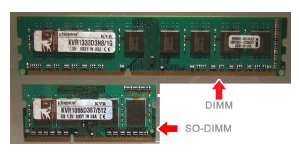
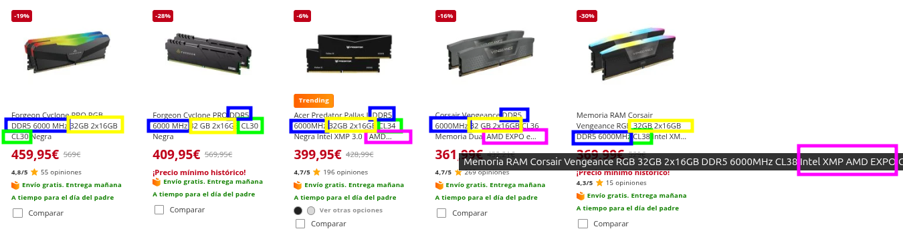
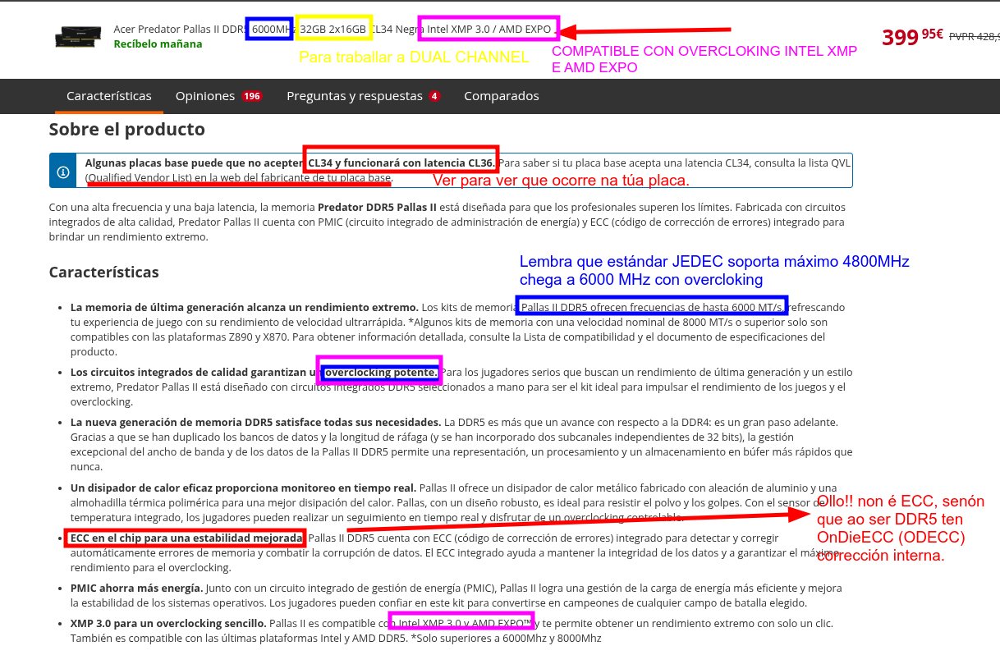
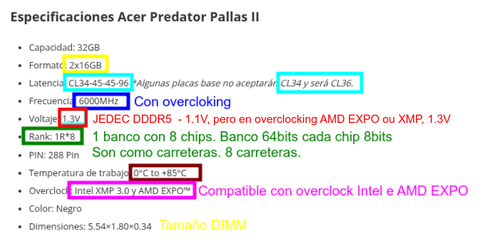
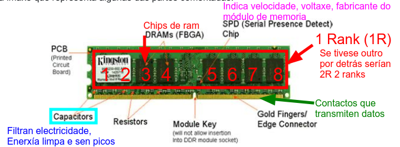
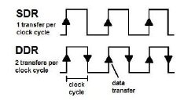
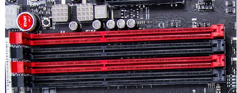

# Memoria RAM: Fundamentos Técnicos

## Definición Técnica

A **Memoria RAM (Random Access Memory)** é un dispositivo de almacenamento volátil de acceso rápido integrado na placa base do computador. Os datos almacenados desaparecen ao desconectar a alimentación eléctrica. Funciona como zona de traballo do procesador, almacenando instrucións e datos que precisa durante a execución de programas.

### Características Principais

- **Acceso Aleatorio:** Calquera posición de memoria pode ser accedida en tempo constante
- **Volátil:** Perda de datos ao cortar a alimentación
- **Síncrona:** Operacións sincronizadas co reloxo do sistema
- **Tecnoloxía DRAM:** Capacitores que almacenan información en forma de carga eléctrica

---

## 1. Guía de Compra: Memoria RAM para PC ou Portátil

Para elixir a memoria correcta para un PC ou portátil, debemos fixarnos nestes catro piares fundamentais:

### 1.1 Formato Físico

* **DIMM (*Dual In-line Memory Module*):** Módulos longos deseñados para ordenadores de sobremesa.
* **SO-DIMM (*Small Outline DIMM*):** Módulos máis curtos e compactos, específicos para portátiles, Mini-PCs e algunhas placas base integradas.



### 1.2. Tecnoloxía e Xeración 

* **Compatibilidade:** A xeración (**DDR4, DDR5**, etc.) debe coincidir coa ranura da placa base.
* **Non hai retrocompatibilidade**. Cada xeración ten unha **muesca física** (key notch) nunha posición distinta e traballa a **voltaxes** diferentes para evitar erros de instalación.

### 1.3. Frecuencia e Capacidade

* **Velocidade (MT/s):** É vital verificar que tanto o procesador (CPU) como a placa base soportan a frecuencia da memoria (ex. 3200 MT/s ou 6000 MT/s).
* **Cantidade (GB):** Debe ir acorde ao uso do sistema. Actualmente, o estándar mínimo recomendable para un rendemento fluído é de **16 GB**.

### 1.4. Canle de Memoria (Dual Channel)

* **Configuración:** Sempre que sexa posible, é preferible instalar os módulos por parellas (ex. **2x8 GB** en lugar de **1x16 GB**). 
* **Vantaxe:** Isto activa o *Dual Channel*, o que permite duplicar o ancho de banda de comunicación entre a RAM e o procesador.

### 1.5 Cantidade de memoria que soporta a placa

Mirar no manual da placa as especificacións da cantidade máxima de memoria que soporta.

- En canto a **ECC**, esta técnica é para servidores, aínda que hai algunha CPU AMD que a soporta, son poucos modelos de alta gama, e que hai que revisar ben a placa.



#### Analizamos esta memoria antes de ver características

[Acer Predator Pallas II DDR5 6000MHz 32GB 2x16GB CL34 Negra Intel XMP 3.0 / AMD EXPO](https://www.pccomponentes.com/acer-predator-pallas-ii-ddr5-6000mhz-32gb-2x16gb-cl34-negra-intel-xmp-30-amd-expo)





**Estrutura dos módulos de RAM**



---

## 2. Tipos de Memoria RAM Actuais

A evolución dos estándares de memoria de acceso aleatorio (RAM) reflicte a necesidade **constante de maior ancho de banda e eficiencia enerxética** na computación moderna. **Actualmente**, o mercado transita entre as tecnoloxías **DDR4** e **DDR5**, mentres os organismos de normalización definen as bases da futura DDR6.

### 2.1 DDR4 (Double Data Rate 4)

**Especificacións Técnicas:**

- **Voltaxe:** 1.2V ± 0.06V
- **Frecuencia:** 2133 MHz - 3200 MHz (estándar JEDEC)
- **Overclocking:** Até 4800+ MHz con **XMP**
- **Pines:** 288 pines (DIMM estándar)
- **Canles de Datos:** 64 bits por DIMM
- **Ancuro de Banda:** 21.3 GB/s (DDR4-2666) a 51.2 GB/s (DDR4-4800)

A placa base ten un circuito regulador de voltaxe e envía a enerxía lista aos módulos de memoria.

**Estructura da memoria:**

- 8 ou 16 bancos de memoria
- Dentro dos bancos de memoria a información organízase en **filas e columnas**, como se fose unha folla de cálculo:
  - Fila (tamaño): 512 bits
  - Columna(tamaño): variable segundo o modelo (En función do tamaño do chip)
- Cando a CPU le un dato, non lé so ese bit, senón que le a fila completa de 512bits e gárdaa nun buffer (*Row Buffer*)

### 2.2 DDR5 (Double Data Rate 5)

**Especificacións Técnicas:**

- **Voltaxe:** 1.1V ± 0.05V
- **Frecuencia:** 4800 MHz - 6400+ MHz (estándar JEDEC)
- **Pines:** 288 pines (DIMM estándar, fisica diferente)
- **Canles de Datos:** 2× 32 bits (arquitetura de doble canle interna)
- **Ancuro de Banda:** 38.4 GB/s (DDR5-4800) a 102.4 GB/s (DDR5-6400)
- **Sub-canles:** 2 sub-canles de 16 bits por lado (para xestión interna dentro do canle de 32bits)
- **Regulador Integrado:** **PMIC** (Power Management IC) na DIMM

O circuíto regulador de voltaxe (**PMIC**) está integrado no **propio módulo de memoria**, os módulos son máis complexos e quéntanse algo máis que os predecesores. 

**Vantaxes sobre DDR4:**

- Voltaxe reducida (menor consumo, 8.3% máis eficiente)
- **Doble ancho de banda teórico**: débese a que nas DDR5, cada módulo de memoria divídese en **2 sub-canles internas**, de **32 bits** cada unha, de forma que se os núcleos da CPU solicitan info de pequeno tamaño a memoria, cada subcanle pode dar información independente á CPU, estas canles poden ser de lectura ou escritura, facendo que o tráfico sexa máis fluído, xa que unha canle pode estar facendo unha lectura e outra unha escritura, mentres nas DDR4, ao haber un so canle, so pode facer unha operación ao mesmo tempo.
- **Mellor escalabilidade en frecuencia**: xa qu eo módulo PMIC, módulo de regulación de voltaxe no propio chip reduce o ruído eléctrico e permite subir a frecuencia. A tecnoloxía **ODECC**, On-Die ECC, corrixe erros dentro do chip de memoria (*non confundir esta tecnooxía coa ECC que teñen os módulos RAM dos servidores*),

> Isto indica que aínda que a **igual ancho de banda, a eficiencia de acceso é moito mellor** a de DDR5 motivado pola subdivisión de canles.

### 2.3 Comparativa DDR4 vs DDR5

| Parámetro | DDR4 | DDR5 |
|-----------|------|------|
| Voltaxe | 1.2V | 1.1V |
| Frecuencia Base | 2133-3200 MHz | 4800-6400 MHz |
| Ancho de Banda | 17-51 GB/s | 38-102 GB/s |
| Latencia CAS | 15-20 | 30-40 |
| Pines | 288 | 288 (diferente) |
| PMIC | Externo | Integrado |
| Consumo | Normal | Reducido |

> **Ollo!** Cando o fabricante amosa DDR4-2666, xa está duplicando o flanco de subida e de baixada en DDR a frecuencia é 1333 e as MT/s son 2666
> 

| Xeración | Estándar JEDEC | Velocidade (MT/s) | Frecuencia Reloxo (MHz) |
| :--- | :--- | :--- | :--- |
| **DDR4** | DDR4-2133 | 2133 | 1066.5 |
| **DDR4** | DDR4-2666 | 2666 | 1333 |
| **DDR4** | DDR4-3200 | 3200 | 1600 |
| **DDR5** | DDR5-4800 | 4800 | 2400 |
| **DDR5** | DDR5-5200 | 5200 | 2600 |
| **DDR5** | DDR5-5600 | 5600 | 2800 |
---

## 3. Parámetros de Latencia e Timing

### 3.1 Latencia CAS (CL - CAS Latency) vs Latencia Real

Número de ciclos de reloxo que **tarda en accederse aos datos** desde o envío da orde de lectura.

A latenncias CAS, é distinta que a Latencia Real.

- **DDR4:** CL15-CL20 (típico CL16, necesita 16 ciclos para acceder)
- **DDR5:** CL30-CL40 (típico CL36-CL38, **necesita 36 ciclos para acceder, pero nestas memorias a frecuencia é maior, así que a latencia real pode ser menor**.)

$$\text{Latencia Real (ns)} = \frac{\text{CL}}{f \text{ MHz}} \times 1000$$

**Exemplo DDR4-3200 CL16:**
$$\text{Latencia} = \frac{16}{3200} \times 1000 = 5 \text{ ns}$$

**Exemplo DDR5-6400 CL38:**
$$\text{Latencia} = \frac{30}{6400} \times 1000 = 4.6 \text{ ns}$$

### 3.2 Timings

Os timings son os **tempos de espera que o controlador de memoria ten que respectar entre as distintas operacións**. Pénsao como os semáforos dunha cidade: aínda que un coche poida ir moi rápido (frecuencia), se os semáforos tardan moito en poñerse en verde, o tempo total de viaxe será maior.

Como a información está en Bancos e dentro destes en Filas e Columnas, hai uns tempos de acceso a fila, columna, desactivar esa fila, tempo que esa fila pode estar aberta,...

- **tRCD (RAS to CAS Delay):** É o tempo que pasa dende que se escolle a fila ata que se pode acceder á columna.
- **tRP (RAS Precharge):** É o tempo necesario para "pechar" unha fila e deixar o banco listo para abrir outra.
- **tRAS (Row Active Time):** Define canto tempo ten que estar aberta unha fila como mínimo para que os datos non se corrompan.
- **tCR (Command Rate):** é o tempo que tarda o controlador desde que selecciona un módulo antes de poder empezar a falarlle. Os valores poden ser: 1T é máis rápido, e 2T que é mais lento pero ofrece un sinal máis estable.
- **tRFC (Refresh Cycle):** Como a RAM é dinámica, perde a carga. Este valor indica canto tempo para a memoria para "recargarse".

### 3.3 Frecuencia e Ancho de Banda

$$\text{Ancho de Banda (MB/s)} =  \text{ Frecuencia(MHz=MT/s)} \times Canles \times \text{Ancho do bus (bytes)} = \frac{\text{MT/s} \times 8}{1000}$$

> Lembrade que a **Velocidade de transferencia** é o ancho de banda efectivo, a velocidade á que pasan realmente.

#### **DUAL CHANNEL**

**Exemplo DDR4-3200 en dual channel:**

- **Ancho de banda = 3200 × 2 × 8 bytes = 51.2 GB/s**
  - MT/s = 3200 ( Megatransfers/segundo)
  - Canles = 2
  - Ancho bus = 64 bits = 8 bytes

**Exemplo DDR5-6400 en dual channel:**

- MT/s = 6400 ( Megatransfers/segundo)
- Ancho de banda = 6400 × 2 × 8 bytes = 102.4 GB/s
  - MT/s = 6400 ( Megatransfers/segundo)
  - Canles = 2
  - Ancho bus = 64 bits = 8 bytes

#### **SINGLE CHANNEL**
**Exemplo DDR5-6400 en Single Channel (1 so módulo de memoria nun PC):**

- MT/s = 6400 ( Megatransfers/segundo)
- Ancho de banda = 6400 × 1 × 8 bytes = 51.2 GB/s
  - MT/s = 6400 ( Megatransfers/segundo)
  - Canles = 1
  - Ancho bus = 64 bits = 8 bytes

 e este caso, canto sería? **Exemplo DDR4-3200 en single channel, 1 so módulo de memoria no PC??**

```shell
 # Resolve

 ```

---

## 4. Tecnoloxías de Optimización

### 4.1 Dual Channel

**Concepto:** A placa base dispoñe de 2 controladores de memoria independentes funcionando en paralelo.

**Configuración::**

- Dúas DIMM en canles diferentes
- Cada canle: 64 bits de datos en paralelo
- Ancho de banda total: 2× ancho de banda simple

**Beneficio:** +50% de rendimiento en operacións paralelas (transferencias simultáneas)

**Organización Típica:**

- Adoitan usarse os slots que están mais lonxe da CPU
- Na maioría das placas veñen coloreados da misma forma os slots que traballan en dual channel



**Flex Memory**
Algunhas placas base modernas teñen unha tecnoloxía chamada Intel **Flex Memory**. Imaxina que temos **un módulo de 8 GB e outro de 4 GB**.

Se os coloca correctamente nas slots de distintas canles (A2 e B2):

- Os **primeiros 4 GB** de cada módulo (8 GB en total) funcionarán en **Dual Channel**.
- Os **4 GB restantes** do módulo maior funcionarán en **Single Channel** .

Isto axuda a que o sistema sexa máis eficiente incluso con módulos desparellos.

### 4.2 Triple Channel e Quad Channel

- **Triple Channel:** 3 DIMM en paralelo (plataformas HEDT Intel X79/X99) -- **NON USADO A DÍA DE HOXE**.
- **Quad Channel:** 4 DIMM en paralelo (plataformas servidor e HEDT). O bus é de **256bits**.
  - **HEDT** (High-End Desktop): Para usuarios profesionais que fan renderizado 3D ou edición de vídeo 8K.
  - **Servidores**: É o estándar en máquinas que moven bases de datos ou virtualización masiva. **Intel Xeon e AMD EPYC** (estes últimos poden chegar incluso a 8 ou 12 canles de memoria!).

### 4.3 Overclocking de RAM en Estacións de Traballo

#### 4.3.1. XMP (Intel eXtreme Memory Profile)

É un estándar de Intel que contén perfís de configuración predefinidos e probados polo fabricante da memoria. Permite que **a placa base axuste automaticamente a frecuencia, voltaxe e timings** por riba das especificacións estándar (JEDEC) para **acadar o máximo rendemento**.

XMP é de Intel. Porén, os fabricantes de placas base para AMD (como *ASUS, Gigabyte ou MSI*) levan anos incluíndo tecnoloxías para "ler" eses perfís de Intel. Nas **BIOS de AMD aparece como DOCP, EOCP ou simplemente XMP**.

**Velocidades Comúns com XMP:**
- XMP 3000, 3200, 3600, 4000, 4400, 4800 MHz

#### 4.3.2 AMD EXPO (AMD eXtreme Memory Profile)

É a alternativa de **AMD para a arquitectura DDR5**. Funciona exactamente igual que o XMP, pero é un **estándar aberto** e está optimizado especificamente para maximizar a eficiencia e a velocidade nos procesadores AMD Ryzen.

- En **placas AMD**: Podes usar tanto memorias con XMP como con EXPO. A BIOS recoñecerá ambos.
- En **placas Intel**: O soporte para EXPO é menos común pero está *empezando a aparecer en actualizacións de BIOS de gama alta*. O máis habitual é mercar XMP para Intel.

> Nos últimos procesadores con DDR5, JEDEC ten unha postura máis conservadora de **4800Mhz**, e para chetar aos **6000MHz** hai que empregar **AMD Expo** ou **XMP**
> *mpte*: aínda que a RAM teña este perfil, o **procesador** e o **chipset** teñen que permitir facer este overcloking, por exemplo, **en Intel, por exemplo, os chipsets serie "B" e "Z" permíteno, pero a serie "H" básica adoita estar limitada**

---

## 5. Estándares e Organismos de Regulación de Hardware

A interoperabilidade entre compoñentes de distintos fabricantes é posible grazas a organismos que definen normas técnicas estritas:

- **JEDEC (Joint Electron Device Engineering Council)**: É o referente para a memoria RAM. Define os estándares físicos (como o número de pins en DIMM ou SO-DIMM) e os eléctricos (frecuencias base, voltaxes e latencias). **Unha memoria "JEDEC" garante que funcionará en calquera placa base** compatible sen configuración previa.
- **IEEE (Institute of Electrical and Electronics Engineers)**: Organización global que estandariza dende arquitecturas de computadores ata protocolos de rede. As súas normas **aseguran que a comunicación entre compoñentes e sistemas** siga regras lóxicas e físicas universais.

- **Consorcios Específicos** (PCI-SIG e USB-IF): Grupos de empresas que desenvolven tecnoloxías concretas:
  - **PCI-SIG**: Define o bus PCI Express, fundamental para a comunicación de alta velocidade en tarxetas gráficas e unidades NVMe.
  - **USB-IF**: Xestiona todo o ecosistema USB, definindo conectores (como o USB-C) e velocidades de transferencia.

| Característica | Estándar Aberto (ex. JEDEC/RAM) | Consorcio con Licenza (ex. HDMI/USB) |
| :--- | :--- | :--- |
| **Acceso á norma** | Calquera pode ler e implementar a norma sen pagar por ela. | Require ser membro do consorcio ou pagar "royalties". |
| **Fabricación** | Fomenta unha competencia total entre moitos fabricantes. | O control está en mans dun grupo que dita quen pode usar a marca. |
| **Evolución** | Máis lenta pero moi sólida e compatible. | Máis rápida en funcións comerciais (novos logos, cables). |

> Se o estándar fose **pechado** e o fabricante decidise deixar de dar soporte ou comezase a cobrar licenzas carísimas polo acceso aos planos técnicos, o técnico atoparíase con que os **módulos de reposto serían moito máis difíciles de atopar** e probablemente moitísimo máis caros, xa que **non habería competencia de terceiros** fabricantes que puidesen replicar esa tecnoloxía de xeito legal.

## 5. Estrutura Física e Empaquetado

### 5.1 DIMM (Dual In-line Memory Module)

**Especificacións Estándar:**
- **Tamaño:** 133.35 mm × 30 mm (altura estándar)
- **Pines:** 288 pines (DDR4/DDR5)
- **Altura con disipador:** Até 47 mm (requiere revisión de compatibilidade con coolers)
- **Slots na placa base:** Typ. 2-4 (M.2 compatibles en DDR5)

### 5.2 SO-DIMM (Small Outline DIMM)

**Para portátiles e sistemas compactos:**
- **Tamaño:** 69.15 mm × 30 mm
- **Pines:** 260 pines (DDR4) ou 262 pines (DDR5)
- **Altura:** 7.5-17 mm (máis compacta)

### 5.3 RG-DIMM (Registered DIMM)
**Para servidores:**
- **Rexistro de voltaxe:** nos servidores o controlador de memoria é un chip intermedio, que recibe as sinais de petición de memoria e estabilízaas antes de solicitarllas á RAM.
- **ECC** bits que permiten detectar e corrixir erros.
- **Memoria Persistente**, Tecnoloxías que permiten que os datos da RAM non se borren ao apagar o servidor.
- **Compatibilidade:** Non é compatible con placas base de desktop

### 5.4 Xerarquía de Memoria (Die Layout)

No seguinte esquema pode verse como está estruturada a memoria RAM, organización, como se xestiona o control interno da memoria e pines que usa para que cousa .

```
DIMM (133.35 × 30 mm)
  ├─ 8-16 Bancos de Memoria
  │  ├─ Filas (Rows): 16,384 - 65,536
  │  └─ Columnas (Columns): 1024-2048
  ├─ Circuitería de Control
  │  ├─ Controlador de Fila
  │  ├─ Controlador de Columna
  │  └─ Circuitería de Refresco
  └─ Pines de Conexión (288)
     ├─ Datos (DQ0-DQ63): 64 bits
     ├─ Enderezo (A0-A17): 18 bits
     ├─ Control (RAS, CAS, WE, CS)
     └─ Enerxía (VDD, VSS, VREF)
```

---

## 6. Procedementos de Seguridade Específica para Memoria RAM

### 6.1 Descarga Electrostática (ESD)

**CRÍTICO: Non tocar ningunha pista de cobre das DIMMs directamente**

Pasos de prevención:

1. ✅ **Antes de manipular:** Ponte una pulseira antiestática conectada a masa
2. ✅ **Protección do lugar de traballo:** Usa tapete antiestático conexado
3. ✅ **Desconexión:** Desconecta a fonte de alimentación antes de abrir o computador
4. ✅ **Descarga previa:** Toca a estrutura metálica de case antes de coller a DIMM
5. ✅ **Almacenamento:** Guarda DIMMs en bolsas Faraday ou antiestáticas


### 6.2 Seguridade Eléctrica

- ⚠️ **Non manipular con computador encendido** (risco de curtocircuito ou dano a placa base)
- ⚠️ **Desconectar fonte de alimentación** antes de abrir a carcasa
- ⚠️ **Desconectar de tomacorrente** (non basta con apagar; hai capacitores na fonte cargados)

### 6.3 Procedementos de Instalación Seguros

1. **Desconecta e espera 5 minutos** para dissipación de carga
2. **Localiza os slots correctos** (consulta manual da placa base)
3. **Abre plenamente as pestañas laterais** do slot (soan con clic)
4. **Aliña a muesca na DIMM** co pin central do slot (previne erros)
5. **Inserta con presión uniforme** en ambos extremos (evita damping lateral)
6. **Reconnecta e proba** (Comprueba que o BIOS detecta a memoria)

### 6.4 Sinais de Dano ou Fallo

- Ordenador non inicia (beep repetido do speaker)
- Aviso de memoria instalada incorrecto (pantalla verde ou POST fallido)
- Memoria non detectada en BIOS/UEFI
- Erros de corrección ECC ou fallos de integridade

**Solución:** Extrae, limpa os contactos con éter (en lugar ventilado) ou alcohol isopropílico, e reinserta coidadosamente.

---

## 7. Configuracións Recomendadas

| Uso | Recomendación | Especificación |
|-----|---|---|
| Gaming 1080p/1440p | 16 GB Dual Channel | DDR5-6000 CL30 EXPO |
| Workstation (CAD/3D) | 32 GB Dual Channel | DDR5-5600 CL36 Intel XMP |
| Servidor | 64-128 GB | DDR5 ECC RG-DIMM |
| Portátil Gaming | 32 GB SO-DIMM | DDR5-5600 |

---

## 8. Referencias Técnicas

- JEDEC Standard DDR4 (JESD79-4)
- JEDEC Standard DDR5 (JESD79-5)
- Intel XMP Specification v3.0
- AMD EXPOSITION Memory Profile (AGESA 1.0.8.1+)

## 9. Páxinas interesantes

- [Crucial](https://www.crucial.com/)
- [Kingston](https://www.kingston.com/es/memory)

---
