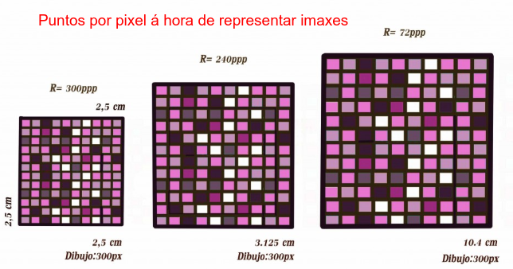
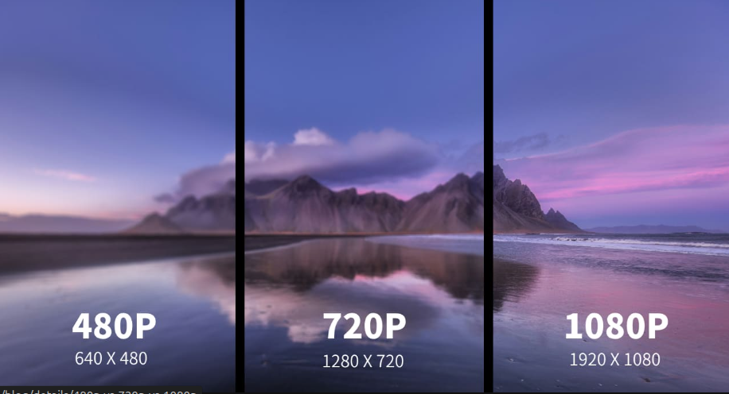

# Conceptos Fundamentais de Rendemento Gráfico

## 1. Píxeles (Unidade de Resolución)

O píxel (*picture element*) é a unidade física máis pequena de visualización nun monitor.

* **Composición:** Cada píxel está formado xeralmente por subpíxeles **RGB** (Red, Green, Blue). A combinación de intensidades destes subpíxeles define a cor final.
* **Resolución:** É o produto da matriz de píxeles (ex: $1920 \times 1080$). A maior densidade de píxeles (**PPI** - *Pixels Per Inch*), maior definición e espazo de traballo.
* **Carga computacional:** Para a GPU, cada píxel representa un cálculo de *shading*. Aumentar a resolución de 1080p a 4K quadruplica a carga de traballo de rasterización.

Vemos a diferenza na imaxe, dunha imaxe con** 480p, 720p e 1080p**, que é a que se ve máis **nítida**.

## 2. Taxa de Refresco do Monitor (Hz)

A taxa de refresco é unha especificación **física do monitor**.

* **Definición:** Indica cantas veces por segundo o panel é capaz de actualizar a imaxe que amosa. Mídese en Hercios (Hz).
* **Limitación:** Se un monitor é de 60Hz, por moito que a GPU procese máis fotogramas, o ollo humano só verá 60 imaxes distintas por segundo.
* **Tecnoloxías de sincronización:** Conceptos como **G-Sync** ou **FreeSync** permiten que o monitor adapte a súa taxa de refresco en tempo real aos fotogramas que envía a GPU, evitando o *tearing* (fragmentación da imaxe).

## 3. FPS (Frames Per Second)

Os FPS son unha métrica de **rendemento do software e hardware** (GPU/CPU).

* **Definición:** O número de fotogramas que a tarxeta gráfica xera e envía ao monitor nun segundo.
* **Fluidez vs. Latencia:** Uns FPS altos non só achegan fluidez visual, senón que reducen o *input lag* (o tempo entre unha acción do usuario e a súa representación na pantalla).
* **O "Colo de Botella":** Se os FPS son moito maiores que os Hz, desperdíciase enerxía e xérase calor innecesario. Se os FPS son menores que os Hz, prodúcese o efecto de *stuttering* ou repetición de frames.

## 4. Criterios de Selección: Tarxeta Gráfica (GPU)

Á hora de escoller entre unha solución integrada (iGPU) ou dedicada/externa (dGPU), debemos avaliar os seguintes parámetros técnicos:

### A. Arquitectura e Núcleos de Procesamento

Non todos os núcleos son iguais. Debemos fixarnos na arquitectura (ex: NVIDIA Ada Lovelace, AMD RDNA 3).

* **CUDA Cores (NVIDIA) / Stream Processors (AMD):** Son os procesadores paralelos encargados dos cálculos matemáticos.
* **RT Cores / Tensor Cores:** Cruciais se o traballo require *Ray Tracing* en tempo real ou aceleración de Intelixencia Artificial e Deep Learning.

### B. VRAM (Memoria de Vídeo)

A memoria dedicada da tarxeta. É crítica para:

* **Texturas e Resolución:** Canto maior sexa a resolución do proxecto, máis VRAM se consome.
* **Ancho de banda:** Non só importa a cantidade (GB), senón a velocidade (GDDR6, GDDR6X) e o bus de memoria (bits). Un bus estreito pode limitar unha GPU potente.

### C. TGP / TDP (Consumo Enerxético)

* **Alimentación:** As gráficas potentes requiren fontes de alimentación (PSU) con certificación de eficiencia e conectores específicos (ex: PCIe 5.0 12VHPWR).
* **Disipación:** O deseño térmico determinará se a tarxeta sufriará *thermal throttling* (baixada de frecuencia por exceso de calor).

### D. CONECTORES DE VÍDEO dos que dispoñen

| Interface | Audio | 1080p (FHD) | 1440p (2K) | 2160p (4K) | Técnica |
| :--- | :---: | :---: | :---: | :---: | :--- |
| **VGA** | Non | 60 Hz | N/S | N/S | Analóxico |
| **DVI-DL** | Non | 144 Hz | 60 Hz | N/S | Dixital |
| **HDMI 1.4** | Si | 144 Hz | 75 Hz | 30 Hz | 8.16Gbpxs |
| **HDMI 2.0** | Si | 240 Hz | **144 Hz** | 60 Hz | 18 Gbps |
| **HDMI 2.1** | Si | 240 Hz+ | **240 Hz** | 144 Hz | 48 Gbps|
| **DisplayPort 1.2** | Si | 240 Hz | **144 Hz** | 60 Hz | 21.6 Gbps |
| **DP 1.4** | Si | 240 Hz+ | **240 Hz** | 144 Hz | 32.4 Gbps |
| **DP 2.1** | Si | 240 Hz+ | **240 Hz+** | 240 Hz | Ata 80 Gbps |
| **ThunderBolt 3** | Si | 240 Hz | **144 Hz** | 60 Hz | Encapsula DP 1.2 sobre USB-C (40 Gbps). |
| **TB 4** | Si | 240 Hz+ | **240 Hz** | 144 Hz | Encapsula DP 1.4 |

### E. Integrada vs. Dedicada (Externa)

| Característica | Integrada (iGPU) | Dedicada (dGPU / eGPU) |
| :--- | :--- | :--- |
| **Ubicación** | Dentro do die da CPU. | Circuíto impreso independente. |
| **Memoria** | Comparte a RAM do sistema (Lento). | VRAM propia de alta velocidade. |
| **Uso ideal** | Ofimática, codificación de vídeo leve. | Gaming, Renderizado 3D, Ciencia de Datos. |
| **Portabilidade** | Máxima (menor consumo e calor). | Require espazo e refrixeración robusta. |

> **Nota:**  Ao escoller unha GPU externa (eGPU), o factor determinante é a interface de conexión. Actualmente, o uso de **Thunderbolt 4** ou **OcuLink** é indispensable para minimizar a perda de ancho de banda polo bus PCIe. **Oculink** é unha extensión do PCIe para tarxetas gráficas, podería empregarse en sistema Mini-ITX e SFF (Small Form Factor).
