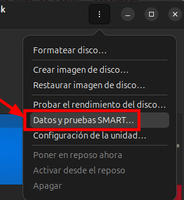
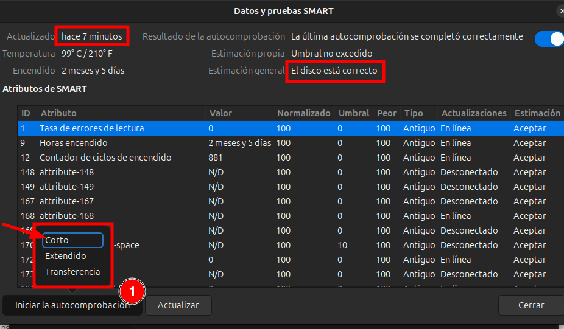
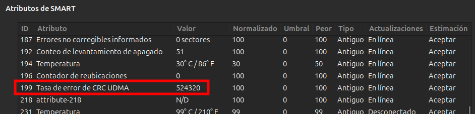
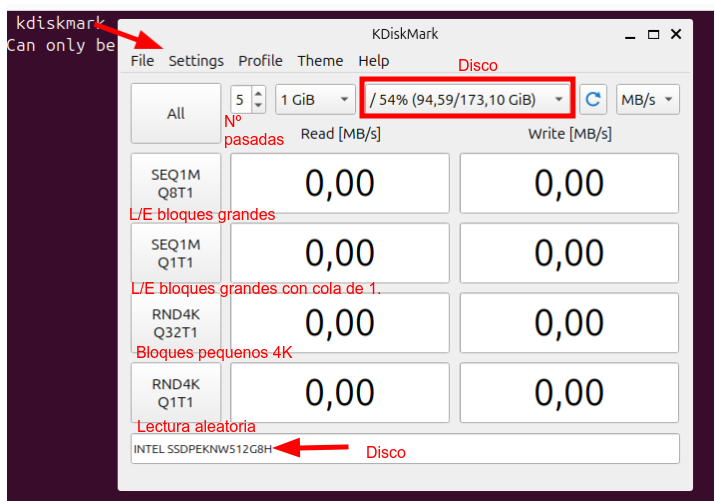

# Ferramentas de Benchmark en Linux - KdiskMark E DISCOS

## 🎯 Obxectivo

* Medir e comparar o rendemento dun **SSD SATA** e un **NVMe**
* Interpretar resultados reais (MB/s, 4K, latencia)
* Identificar cal é máis rápido e por que

---

# 🧰 1. Requisitos previos

### Hardware:

* 1 disco SSD SATA
* 1 disco NVMe

### Sistema:

* Linux (Ubuntu, Debian, etc.)

---

# 2. Ferramenta DISCOS de Ubuntu

Por exemplo, lanzando un test básico podemos obter:



Pódese escoller o test corto, extendido (que son test **firmware**) e transferencia (que mide **rendemento**).



- Valor: O valor real que obtivo no test
- Normalizado: O valor de saúde que lle da ao disco entre 0 e 100, sendo 100 saúde excelente.
- Umbral: Umbral por debaixo do que o disco estaría en mal estado.
- Peor: O valor máis baixo que obtivo o disco durante a súa vida.
- Tipo: Hai dous tipos
  - **Antiguo**: indica que é desgaste natural de antiguedade.
  - **Crítico**: parámetro que indica mal estado.
- Actualizaciones: **online** co disco en funcionamento, como é este caso. **desconectado**, disco non funcionando.
- Estimación: aceptar indica que o valor é correcto.

Por exemplo, este disco deu esta informacion, aínda que os disco está ben, esto indica que o **hai un problema coa conexión de datos do disco**, revisar conector SATA.Parámetro de ERRO, **Tasa de error de CRC UDMA**.




---

# ⚙️ 3. Instalación da ferramenta kdiskmark

### En Ubuntu/Debian:

```bash
sudo apt update
sudo apt install kdiskmark
```

👉 Se non está nos repos:

```bash
sudo apt install flatpak
flatpak install flathub org.kde.kdiskmark
```

---

# 🔍 4. Identificar os discos

Executar:

```bash
lsblk -f
```

👉 Exemplo:

* `/dev/sda` → SSD SATA
* `/dev/nvme0n1` → NVMe

⚠️ IMPORTANTE:

* NON confundir discos
* NON probar sobre o sistema se está en uso intenso

---

# 🧪 5. Preparación da proba

Antes de empezar:

✔️ Pechar programas
✔️ Non copiar arquivos durante o test
✔️ Asegurarse de que os discos teñen espazo libre

---

# ▶️ 6. Executar KDiskMark

Abrir:

```bash
kdiskmark
```


---

## 🔧 Configuración recomendada

En KDiskMark:

* **Test size:** 1 GiB (ou 4 GiB para máis precisión)
* **Runs:** 3–5
* **Drive:** seleccionar o disco (SSD ou NVMe)

---

# 🧪 7. Proba co SSD SATA

1. Seleccionar o SSD (ex: `/dev/sda`)
2. Pulsar **Run All**
3. Agardar a que remate
4. Gardar resultados (captura ou anotación)

---

# 🧪 8. Proba co NVMe

1. Seleccionar o NVMe (ex: `/dev/nvme0n1`)
2. Pulsar **Run All**
3. Agardar
4. Gardar resultados

---

# 📊 9. Interpretación dos resultados

## Valores clave:

### 🔹 Seq (lectura/escritura secuencial)

* Transferencia de ficheiros grandes

👉 Esperado:

* SSD SATA → ~500 MB/s
* NVMe → 1500–7000 MB/s

---

### 🔹 4K (acceso aleatorio) ⚠️ IMPORTANTE

* Uso real (SO, programas)

👉 O NVMe tamén debería ser superior

---

### 🔹 IOPS (se aparece)

* Cantidade de operacións por segundo
* Máis alto = mellor

---

# 📋 10. Cubrir Táboa comparativa 

| Disco    | Seq Read | Seq Write | 4K Read | 4K Write |
| -------- | -------- | --------- | ------- | -------- |
| SSD SATA |          |           |         |          |
| NVMe     |          |           |         |          |

---

# 🧠 11. Preguntas para reflexionar

1. Cal dos discos é máis rápido en secuencial?
2. Hai moita diferenza en 4K?
3. En que tarefas notarías máis o NVMe?
4. O SSD SATA segue sendo válido? Por que?

---

# 🎯 12. Conclusión esperada

* O NVMe é moito máis rápido en secuencial
* En uso real (4K), tamén é mellor
* O SSD SATA segue sendo suficiente para moitos usos

---

# 🚀 EXTRA (nivel avanzado opcional)

Executar test por terminal con **fio**:

```bash
fio --name=test --filename=/dev/sdX --rw=randread --bs=4k --size=1G --numjobs=4
```
